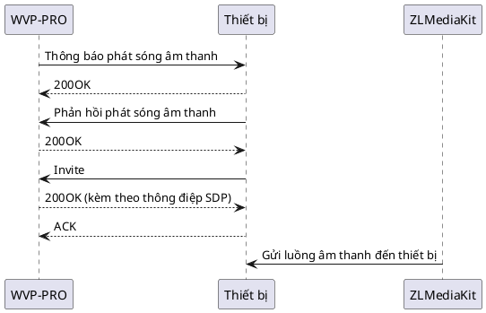
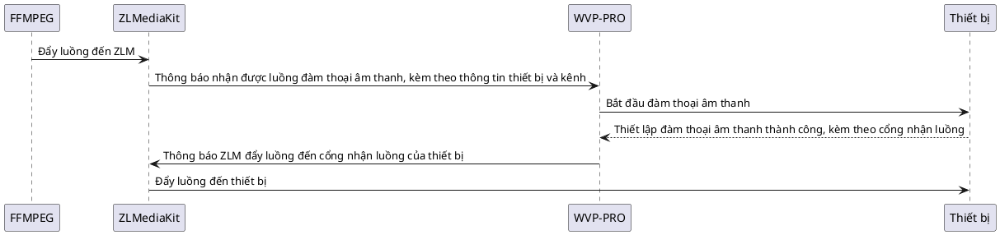

# Đàm thoại âm thanh

## Quy trình và nguyên lý

Đàm thoại âm thanh trong GB/T 28181-2016 được chia thành hai chế độ: broadcast (phát sóng) và talk (đàm thoại). Chế độ broadcast là truyền âm thanh từ máy chủ đến thiết bị, là một chiều. Để thực hiện đàm thoại hai chiều, cần kết hợp với video theo yêu cầu. Chế độ talk hỗ trợ hai chiều, nhưng WVP chỉ xử lý việc truyền âm thanh đến thiết bị giống như broadcast, do đó hai chế độ có thể sử dụng cùng một logic xử lý.

Các thiết bị khác nhau hỗ trợ hai chế độ này khác nhau và thường có sự khác biệt lớn. Các thiết bị khác nhau cũng có sự khác biệt trong việc hỗ trợ cùng một thiết bị, do đó việc tương thích và thích ứng trong đàm thoại âm thanh là vấn đề phổ biến nhất. Chế độ talk đã bị loại bỏ trong GB/T 28181-2022, vì vậy sẽ không thảo luận về nó ở đây.

### 1. Quy trình chế độ broadcast



Khác với quy trình theo yêu cầu, thông điệp invite ở đây được gửi từ thiết bị đến WVP. WVP sẽ đẩy luồng âm thanh đến thiết bị theo cách thức đàm phán invite. Cách thức truyền luồng âm thanh (UDP/TCP bị động/TCP chủ động) được quyết định bởi thiết bị.

## Điều kiện và hạn chế sử dụng

Vì thông điệp invite được gửi từ thiết bị đến WVP, điều này quyết định cách thức gửi luồng âm thanh. Điều này cũng quyết định rằng một số thiết bị không thể sử dụng cho đàm thoại công cộng, ví dụ như hầu hết các thiết bị Hikvision chỉ hỗ trợ cách thức nhận luồng UDP (hiện tại các thiết bị Hikvision mới đã bắt đầu giải quyết vấn đề này). Do đó, nếu WVP ở công cộng và thiết bị ở mạng nội bộ, WVP không thể kết nối với IP của thiết bị và việc gửi luồng sẽ thất bại.

Khác với Hikvision, Dahua và nhiều nhà sản xuất máy ghi hình thực thi pháp luật hỗ trợ cách thức nhận luồng TCP chủ động, do đó có thể thực hiện đàm thoại công cộng.

## Sử dụng ffmpeg để kiểm tra nhanh

Vì trình duyệt yêu cầu trang web hỗ trợ HTTPS để thu thập âm thanh, nếu bạn muốn thực hiện đàm thoại âm thanh trên trang web, bạn phải cấu hình chứng chỉ cho WVP và ZLM để sử dụng HTTPS.

Trong giai đoạn kiểm tra, nếu chỉ muốn kiểm tra chức năng, bạn có thể sử dụng ffmpeg để mô phỏng luồng âm thanh và đẩy đến WVP để thực hiện việc đẩy âm thanh đến camera.

Cú pháp lệnh kiểm tra như sau:

```shell
ffmpeg -re -i {tệp âm thanh} -acodec pcm_alaw -ar 8000 -ac 1 -f rtsp 'rtsp://{IP của ZLM}:{cổng RTSP của ZLM}/broadcast/{mã quốc gia của thiết bị}_{mã quốc gia của kênh}?sign={md5(pushKey)}'
```

Ví dụ:

```shell
ffmpeg -re -i test.mp3 -acodec pcm_alaw -ar 8000 -ac 1 -f rtsp 'rtsp://192.168.1.3:22554/broadcast/34020000001320000001_34020000001320000001?sign=41db35390ddad33f83944f44b8b75ded'
```

Quy trình kiểm tra như sau:



Nếu nghe thấy thiết bị phát âm thanh bạn đã đẩy, điều đó có nghĩa là cuộc gọi thành công, quá trình này chỉ cần đẩy luồng mà không cần gọi bất kỳ giao diện nào.

## Đàm thoại âm thanh trên trang web trong môi trường sản xuất

Trong môi trường sản xuất, nếu là thiết bị khách hàng của bạn, bạn có thể sử dụng cách kiểm tra ffmpeg ở trên, đẩy luồng đến ZLM theo định dạng cố định.

Đối với chương trình WEB, chủ yếu là sự khác biệt giữa mạng nội bộ và công cộng, có hai lý do:

1. Nhiều thiết bị không hỗ trợ đàm thoại công cộng
2. Cách thức lấy chứng chỉ để hỗ trợ HTTPS khác nhau giữa mạng công cộng và mạng nội bộ

### Sử dụng mạng công cộng

Trong mạng công cộng, bạn có thể sử dụng chứng chỉ do nhà cung cấp chứng chỉ hoặc nhà cung cấp dịch vụ đám mây cung cấp, rất tiện lợi.

### Sử dụng mạng nội bộ

Trong mạng nội bộ, bạn cần tạo chứng chỉ tự ký cho WVP và ZLM. Tôi khuyến nghị một cách tạo chứng chỉ tự ký tương đối tiện lợi trên Linux.

Tải công cụ tạo chứng chỉ:

[https://github.com/FiloSottile/mkcert/releases/tag/v1.4.4](https://github.com/FiloSottile/mkcert/releases/tag/v1.4.4)

Cài đặt công cụ này, vào thư mục giải nén của công cụ, thực hiện:

```shell
./mkcert-v1.4.4-linux-amd64 -install
```

Tạo chứng chỉ pem:

```shell
./mkcert-v1.4.4-linux-amd64 IP mạng nội bộ IP mạng nội bộ2 IP mạng nội bộ3
```

Bạn sẽ nhận được hai tệp *-key.pem và *.pem, cấu hình tệp này vào WVP để tải chứng chỉ.

Tạo chứng chỉ cho ZLM:

```shell
cat *.pem *-key.pem > ./zlm.pem
```

Tệp nhận được là chứng chỉ có thể sử dụng cho ZLM.

Có hai cách để sử dụng chứng chỉ trong ZLM:

1. Thay thế default.pem trong ZLM, tức là xóa tệp này và đổi tên zlm.pem thành default.pem
2. Khi khởi động ZLM, thêm `-s zlm.pem`
