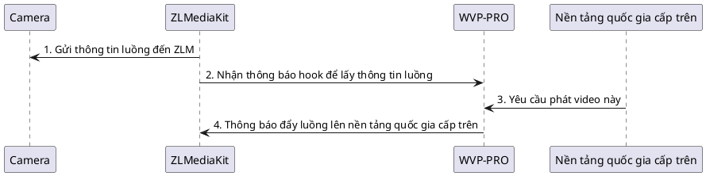

<!-- 拉流代理 -->
# Proxy kéo luồng
Không phải tất cả các camera đều hỗ trợ tiêu chuẩn quốc gia hoặc đẩy luồng, nhưng các thiết bị này có thể nhận được một địa chỉ phát video, thường là giao thức rtsp,
Ví dụ với Dahua:
```text
rtsp://{user}:{passwd}@{ipc_ip}:{rtsp_port}/cam/realmonitor?channel=1&subtype=0
```
Có thể nhận được một địa chỉ luồng như vậy, có thể phát trực tiếp bằng vlc, lúc này chúng ta có thể sử dụng chức năng proxy kéo luồng để đẩy thiết bị này lên các nền tảng quốc gia khác.
Quy trình như sau:

## Thêm proxy
Proxy kéo luồng hỗ trợ hai cách:
1. Proxy luồng trực tiếp trong ZLM, hỗ trợ RTSP/RTMP, không hỗ trợ chuyển mã;
2. Sử dụng ffmpeg để kéo và chuyển mã, có thể thay đổi tham số ffmpeg để hoàn thành chuyển mã.  
   Nhấp vào trang "Thêm proxy", làm theo hướng dẫn, sau khi lưu và kích hoạt thành công, có thể thêm kênh đẩy lên nền tảng cấp trên trong liên kết quốc gia.

PS: Mẫu ffmpeg mặc định không cần thay đổi, nếu cần thay đổi tham số, tự thêm vào tệp cấu hình ZLM.
