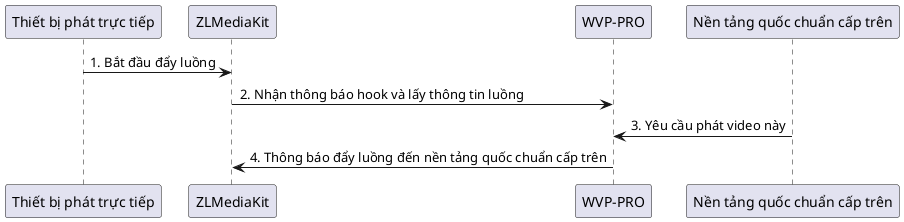

<!-- 推流列表 -->
# Danh sách đẩy luồng
## Mô tả chức năng

WVP hỗ trợ ba cách nhập hình ảnh: phát trực tiếp, [proxy kéo luồng](_content/ability/proxy.md), [quốc chuẩn](_content/ability/device.md). Quy trình kết nối thiết bị phát trực tiếp như sau:

1. Mặc định, khi WVP nhận được thông tin đẩy luồng, thông tin này sẽ xuất hiện trong danh sách. Bạn có thể nhấp vào nút "Thêm vào quốc chuẩn" để cấu hình tên và mã quốc chuẩn cho luồng này. Chỉ những luồng có mã quốc chuẩn mới có thể thêm vào nền tảng liên kết. Sau khi lưu thành công, bạn có thể [thêm kênh đẩy lên nền tảng cấp trên](_content/ability/cascade?id=_2-%e6%b7%bb%e5%8a%a0%e7%9b%ae%e5%bd%95%e4%b8%8e%e9%80%9a%e9%81%93).
2. WVP cũng hỗ trợ nhập hàng loạt kênh trước khi đẩy luồng. Nhấp vào nút "Tải mẫu" và chỉnh sửa mẫu theo hướng dẫn, sau đó nhấp vào nút "Nhập kênh" để nhập dữ liệu kênh. Sau khi lưu thành công, bạn có thể [thêm kênh đẩy lên nền tảng cấp trên](_content/ability/cascade?id=_2-%e6%b7%bb%e5%8a%a0%e7%9b%ae%e5%bd%95%e4%b8%8e%e9%80%9a%e9%81%93).

## Quy tắc xác thực đẩy/kéo luồng
Để bảo vệ máy chủ, WVP mặc định bật xác thực đẩy luồng (hiện tại không hỗ trợ tắt chức năng này).

### Quy tắc đẩy luồng
Khi đẩy luồng, cần kèm theo chữ ký xác thực đẩy luồng (sign). sign=md5(pushKey), pushKey lấy từ bảng người dùng, mỗi người dùng sẽ có một pushKey khác nhau.
Ví dụ: app=test, stream=live, pushKey=1000, ip=192.168.1.4, port=10554 thì địa chỉ đẩy luồng sẽ là:
```
rtsp://192.168.1.4:10554/test/live?sign=a9b7ba70783b617e9998dc4dd82eb3c5
```
Hỗ trợ tùy chỉnh Id xác thực phát khi đẩy luồng, tên tham số là callId, khi đó sign=md5(callId_pushKey).
Ví dụ: app=test, stream=live, pushKey=1000, callId=12345678, ip=192.168.1.4, port=10554 thì địa chỉ đẩy luồng sẽ là:
```
rtsp://192.168.1.4:10554/test/live?callId=12345678&sign=c8e6e01dde2d60c66dcea8d2498ffef1
```
### Quy tắc phát
Mặc định, phát không cần xác thực, nhưng nếu khi đẩy luồng có kèm theo callId, thì khi phát cũng phải kèm theo callId.
Ví dụ: app=test, stream=live, không có callId, ip=192.168.1.4, port=10554 thì địa chỉ phát sẽ là:
```
rtsp://192.168.1.4:10554/test/live
```
Ví dụ: app=test, stream=live, callId=12345678, ip=192.168.1.4, port=10554 thì địa chỉ phát sẽ là:
```
rtsp://192.168.1.4:10554/test/live?callId=12345678
```
