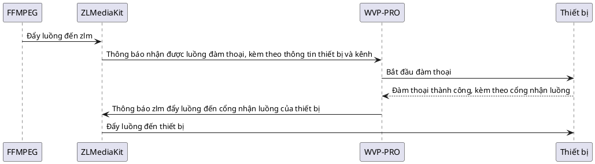
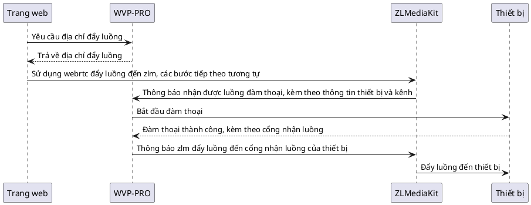

# Sơ đồ nguyên lý

## Sử dụng ffmpeg để kiểm tra nguyên lý đàm thoại

```plantuml
@startuml
"FFMPEG" -> "ZLMediaKit": Đẩy luồng đến zlm
"WVP-PRO" <- "ZLMediaKit": Thông báo nhận được luồng đàm thoại, kèm theo thông tin thiết bị và kênh
"WVP-PRO" -> "Thiết bị": Bắt đầu đàm thoại
"WVP-PRO" <-- "Thiết bị": Đàm thoại thành công, kèm theo cổng nhận luồng
"WVP-PRO" -> "ZLMediaKit": Thông báo zlm đẩy luồng đến cổng nhận luồng của thiết bị
"ZLMediaKit" -> "Thiết bị": Đẩy luồng đến thiết bị
@enduml
```

## Sử dụng trang web để kiểm tra nguyên lý đàm thoại

```plantuml
@startuml
"Trang web" -> "WVP-PRO": Yêu cầu địa chỉ đẩy luồng
"Trang web" <-- "WVP-PRO": Trả về địa chỉ đẩy luồng
"Trang web" -> "ZLMediaKit": Sử dụng webrtc đẩy luồng đến zlm, các bước tiếp theo tương tự
"WVP-PRO" <- "ZLMediaKit": Thông báo nhận được luồng đàm thoại, kèm theo thông tin thiết bị và kênh
"WVP-PRO" -> "Thiết bị": Bắt đầu đàm thoại
"WVP-PRO" <-- "Thiết bị": Đàm thoại thành công, kèm theo cổng nhận luồng
"WVP-PRO" -> "ZLMediaKit": Thông báo zlm đẩy luồng đến cổng nhận luồng của thiết bị
"ZLMediaKit" -> "Thiết bị": Đẩy luồng đến thiết bị
@enduml
```