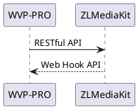

<!-- Cấu hình -->
# Cấu hình
Đối với lần thử nghiệm đầu tiên hoặc người mới, tôi khuyên bạn nên thử nghiệm trong mạng nội bộ và tắt tường lửa của máy chủ và máy khách. Khuyến nghị triển khai trên linux để thử nghiệm.


WVP-PRO thực hiện kiểm soát hành vi của ZLMediaKit thông qua việc gọi API RESTful của ZLMediaKit; ZLMediaKit thông báo cho WVP-PRO thông qua Web Hook API. Bằng cách này, hai bên có thể giao tiếp với nhau.

Đối với cấu hình đơn giản nhất, bạn không cần thay đổi bất kỳ cấu hình mặc định nào của ZLMediaKit. Bạn chỉ cần cấu hình thông tin ZLMediaKit trong WVP-PRO.

## 1 Vị trí tệp cấu hình WVP
Dựa trên phương pháp phát triển spring boot, việc tải tệp cấu hình rất linh hoạt. Mặc định là trong `src/main/resources/application.yml`, một số mục cấu hình là tùy chọn, bạn không cần phải cấu hình tất cả trong tệp cấu hình. Hướng dẫn cấu hình đầy đủ có thể tham khảo `all-application.yml`.

### 1.1 Phương pháp tải tệp cấu hình mặc định
Trong thư mục `target` sau khi đóng gói bằng maven, đã có sẵn tệp cấu hình, tệp cấu hình mặc định là `application.yml`. Kiểm tra nội dung và thấy rằng giá trị `spring.profiles.active` được cấu hình, nếu giá trị được cấu hình là `dev`, thì tệp cấu hình cụ thể sẽ là `application-dev.yml`. Nếu không tìm thấy tệp cấu hình tương ứng, hãy thay đổi giá trị thành `dev`.

```shell
cd wvp-GB28181-pro/target
java -jar wvp-pro-*.jar
```

## 2 Cấu hình WVP-PRO
WVP hỗ trợ nhiều cơ sở dữ liệu, bao gồm Mysql, Postgresql, Kingbase, v.v. Bạn có thể chọn một trong số đó để cấu hình.

### 2.1 Cấu hình cơ sở dữ liệu
#### 2.1.1 Khởi tạo cơ sở dữ liệu
Đầu tiên, tạo cơ sở dữ liệu, sau đó sử dụng `sql/khởi_tạo.sql` để khởi tạo cơ sở dữ liệu. Nếu nâng cấp từ phiên bản cũ, sử dụng `sql/nâng_cấp.sql` để cập nhật.

#### 2.1.2 Cấu hình cơ sở dữ liệu Mysql
Tên cơ sở dữ liệu là `wvp` ví dụ
```yaml
spring:
  dynamic:
    primary: master
    datasource:
      master:
        type: com.zaxxer.hikari.HikariDataSource
        driver-class-name: com.mysql.cj.jdbc.Driver
        url: jdbc:mysql://127.0.0.1:3306/wvp?useUnicode=true&characterEncoding=UTF8&rewriteBatchedStatements=true&serverTimezone=PRC&useSSL=false&allowMultiQueries=true
        username: root
        password: root123
```

#### 2.1.3 Cấu hình cơ sở dữ liệu Postgresql
Tên cơ sở dữ liệu là `wvp` ví dụ
```yaml
spring:
  dynamic:
    primary: master
    datasource:
      type: com.zaxxer.hikari.HikariDataSource
      driver-class-name: org.postgresql.Driver
      url: jdbc:postgresql://127.0.0.1:3306/wvp?useUnicode=true&characterEncoding=UTF8&rewriteBatchedStatements=true&serverTimezone=PRC&useSSL=false&allowMultiQueries=true&allowPublicKeyRetrieval=true
      username: root
      password: 12345678

pagehelper:
  helper-dialect: postgresql
```

#### 2.1.4 Cấu hình cơ sở dữ liệu Kingbase
Tên cơ sở dữ liệu là `wvp` ví dụ
```yaml
spring:
  dynamic:
    primary: master
    datasource:
      type: com.zaxxer.hikari.HikariDataSource
      driver-class-name: com.kingbase8.Driver
      url: jdbc:kingbase8://127.0.0.1:3306/wvp?useUnicode=true&characterEncoding=utf8
      username: root
      password: 12345678

pagehelper:
  helper-dialect: postgresql
```

### 2.2 Cấu hình cơ sở dữ liệu Redis
Cấu hình thông tin kết nối redis trong wvp, khuyến nghị wvp sử dụng một db riêng biệt.

### 2.3 Cấu hình cổng dịch vụ khởi động (có thể sử dụng cấu hình mặc định)
```yaml
# [Tùy chọn] Cổng HTTP mà WVP lắng nghe, trang web và các cuộc gọi API đều sử dụng cổng này
server:
    port: 18080
```

### 2.4 Cấu hình thông tin liên quan đến 28181 (có thể sử dụng cấu hình mặc định)
```yaml
# Cấu hình như một máy chủ 28181
sip:
    # [Tùy chọn] Cổng lắng nghe dịch vụ 28181
    port: 5060
    # Theo quy định trong tiêu chuẩn quốc gia 6.1.2, domain nên sử dụng mã ID của mười ký tự đầu tiên. Phụ lục D của tiêu chuẩn quốc gia định nghĩa tám ký tự đầu tiên là mã trung tâm (bao gồm mã cấp tỉnh, cấp thành phố, cấp quận, cấp cơ sở, tham khảo GB/T 2260-2007)
    # Hai ký tự cuối là mã ngành, tham khảo phụ lục D.3
    # 3701020049 biểu thị cho ngành thông tin của quận Lixia, thành phố Jinan, tỉnh Shandong
    # [Tùy chọn]
    domain: 3402000000
    # [Tùy chọn]
    id: 34020000002000000001
    # [Tùy chọn] Mật khẩu xác thực thiết bị mặc định, sau này mở rộng sử dụng mật khẩu riêng cho từng thiết bị, nếu bỏ mật khẩu sẽ không kiểm tra
    password: 12345678
```

### 2.5 Cấu hình thông tin kết nối ZLMediaKit
```yaml
# Cấu hình máy chủ zlm mặc định
media:
  id: zlmediakit-local
  # [Phải thay đổi] IP nội bộ của máy chủ zlm
  ip: 172.19.128.50
  # [Tùy chọn] Nếu có IP công cộng thì cấu hình IP công cộng, không thể sử dụng tên miền
  wan_ip:
  # [Phải thay đổi] cổng http.port của máy chủ zlm
  http-port: 9092
  # [Tùy chọn] IP mà máy chủ zlm sử dụng để truy cập WVP, mặc định là 127.0.0.1, nếu zlm và wvp không được triển khai trên cùng một máy chủ thì phải cấu hình
  hook-ip: 172.19.128.50
  # [Phải chọn] hook.admin_params=secret của máy chủ zlm
  secret: TWSYFgYJOQWB4ftgeYut8DW4wbs7pQnj
  # Kích hoạt chế độ nhiều cổng, chế độ nhiều cổng sử dụng cổng để phân biệt từng luồng, tương thích tốt hơn. Chế độ một cổng sử dụng ssrc của luồng để phân biệt, đề xuất sử dụng chế độ nhiều cổng để thử nghiệm khi phát trực tiếp bị timeout
  rtp:
    # [Tùy chọn] Có kích hoạt chế độ nhiều cổng hay không, khi kích hoạt sẽ chọn cổng trong phạm vi portRange để truyền tải luồng phương tiện
    enable: true
    # [Tùy chọn] Chọn cổng trong phạm vi này để truyền tải luồng phương tiện, phải cấu hình thuộc tính này trước trên zlm, nếu không tự động cấu hình thuộc tính này có thể không thành công
    port-range: 30000,35000 # Phạm vi cổng
    # [Tùy chọn] Chọn cổng trong phạm vi này để gửi luồng phương tiện trong cấp liên quốc gia,
    send-port-range: 40000,40300 # Phạm vi cổng
```

### 2.6 Cấu hình thông tin tùy chỉnh
```yaml
# [Cấu hình theo nhu cầu kinh doanh]
user-settings:
  # Thời gian chờ phát lại/ghi lại, đơn vị: mili giây
  play-timeout: 180000
  # [Tùy chọn] Tự động phát lại, khi sử dụng địa chỉ luồng cố định để phát lại, nếu chưa phát lại thì tự động phát lại, cần rtp.enable=true
  auto-apply-play: true
  # Ghi lại khi phát trực tiếp
  record-push-live: true
  # Ghi lại theo tiêu chuẩn quốc gia
  record-sip: true
  # Phát lại theo tiêu chuẩn quốc gia, kéo luồng theo yêu cầu, true: có người xem thì kéo luồng, không có người xem thì giải phóng, false: sau khi kéo lên thì không tự động giải phóng
  stream-on-demand: true
```

Tham khảo tệp `all-application.yml` để biết thêm thông tin cấu hình đầy đủ, sao chép mục cấu hình cần thiết vào tệp cấu hình đang sử dụng tương ứng.

Nếu thông tin cấu hình chính xác, bạn có thể khởi động zlm, sau đó khởi động wvp để thử nghiệm. Nếu khởi động thành công, bạn sẽ thấy thông báo kết nối zlm trong nhật ký của wvp.

Tiếp theo [triển khai lên máy chủ](./_content/introduction/deployment.md), nếu bạn chỉ chạy trên máy cục bộ thì chỉ cần chạy trên máy cục bộ.
