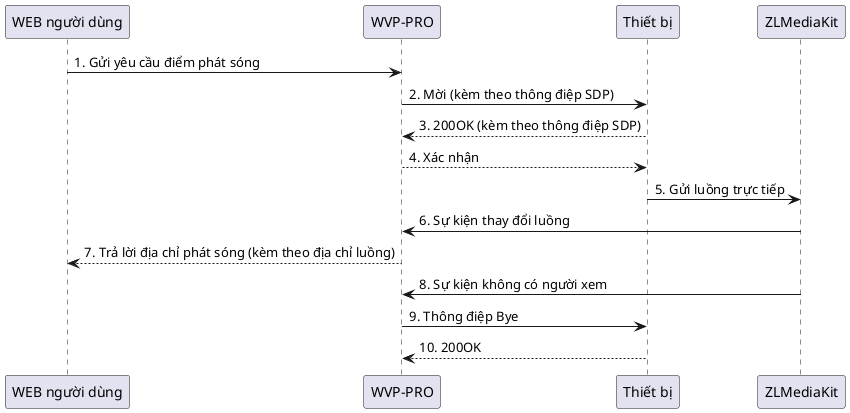
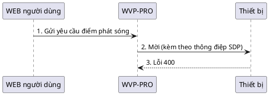

<!-- 点播错误 -->

# Lỗi điểm phát sóng
Để khắc phục lỗi điểm phát sóng, trước tiên bạn cần hiểu [quy trình cơ bản của điểm phát sóng](_content/theory/play.md), quy trình chung như sau:

Đối với một số lỗi phổ biến, chúng ta sẽ phân tích để dễ dàng giải quyết các vấn đề thường gặp
## Nhận mã lỗi khi điểm phát sóng
Lỗi này thường xuất hiện khi nhấn nút "Phát" và nhận được lỗi ngay lập tức.
1. **Mã lỗi 400**  
   Khi xuất hiện mã lỗi 400, quy trình thường như sau:

Lúc này, thiết bị thường cho rằng WVP đã gửi thông điệp sai hoặc không đầy đủ, do đó trả về lỗi 400. Chúng ta cần [bắt gói tin](_content/skill/tcpdump.md) để phân tích xem có thiếu nội dung hay không, hoặc liên hệ với đối tác để hỏi lý do trả về lỗi 400.
WVP không thể đảm bảo tương thích với tất cả các thiết bị, một số thiết bị không tuân thủ tiêu chuẩn có thể gặp vấn đề khi kết nối, bạn có thể liên hệ tác giả để được hỗ trợ kết nối.
2. **Mã lỗi 500**  
   Mã lỗi 500 hoặc lớn hơn 500 nhưng nhỏ hơn 600 thường do lỗi nội bộ của thiết bị. Có hai cách giải quyết: thứ nhất là liên hệ với bộ phận hỗ trợ của thiết bị/nền tảng để tìm giải pháp; thứ hai, nếu bạn chắc chắn có thể kết nối với nền tảng này, bạn có thể gửi gói tin kết nối với nền tảng và gói tin kết nối với WVP cho tôi để tôi thử giải quyết.

## Quá thời gian điểm phát sóng
Quá thời gian điểm phát sóng có thể chia thành hai loại: quá thời gian điểm phát sóng và quá thời gian nhận luồng
1. **Quá thời gian điểm phát sóng**  
   Lỗi quá thời gian điểm phát sóng thường do tín hiệu quá thời gian, ví dụ như không nhận được phản hồi từ đối tác trong thời gian dài, có thể xảy ra ở bước “3. 200OK (kèm theo thông điệp SDP)”, tức là chúng ta gửi thông điệp điểm phát sóng nhưng thiết bị không phản hồi, có thể do:
> 1. Lỗi nội bộ của thiết bị, không thể phản hồi thông điệp
> 2. Lỗi mạng khiến thông điệp không đến được thiết bị

Phần lớn trường hợp là do nguyên nhân thứ 2, vì vậy khi gặp lỗi này, chúng ta cần kiểm tra mạng của mình trước. Nếu bạn triển khai trên mạng công cộng, có thể do chu kỳ heartbeat quá dài, dẫn đến NAT của router hết hạn, thông điệp của WVP không thể gửi đến thiết bị qua địa chỉ IP và cổng ban đầu.

2. **Quá thời gian nhận luồng**  
   Quá thời gian nhận luồng có thể xảy ra ở bước 5 và 6, có thể do:
> 1. Thiết bị đã gửi luồng nhưng gửi đến sai địa chỉ IP và cổng, thông tin này được chỉ định trong thông điệp SDP của bước 2 Mời (kèm theo thông điệp SDP), lỗi này có thể do cấu hình sai, ví dụ bạn đặt địa chỉ 127.0.0.1 khiến thiết bị gửi luồng đến 127.0.0.1, hoặc WVP của bạn trên mạng công cộng nhưng bạn cung cấp cho thiết bị một địa chỉ IP nội bộ, khiến thiết bị không thể gửi luồng đến;
> 2. Lỗi nội bộ của thiết bị, không gửi luồng;
> 2. Thiết bị đã gửi luồng nhưng luồng không thể nhận diện, có thể do luồng không tuân thủ tiêu chuẩn hoặc mạng rất kém;
> 3. Thiết bị đã gửi luồng, ZLM cũng đã nhận được nhưng ZLM không thể thông báo cho WVP qua hook, lúc này bạn cần kiểm tra cấu hình hook của ZLM, xem có thể kết nối từ ZLM đến WVP hay không;
> 4. Thiết bị đã gửi luồng nhưng bật kiểm tra SSRC, luồng của thiết bị không tuân thủ tiêu chuẩn sử dụng SSRC sai, khiến ZLM bỏ qua;

Đối với các nguyên nhân lỗi này, tôi đề xuất thứ tự kiểm tra như sau:
- Tắt kiểm tra SSRC;
- Kiểm tra cấu hình hook của ZLM có thể kết nối đến ZLM hay không;
- Kiểm tra nhật ký của ZLM xem có đăng ký luồng hay không;
- Bắt gói tin để kiểm tra thông tin luồng, xem luồng có được gửi đúng không, thậm chí có thể xuất luồng gốc và phát bằng VLC để kiểm tra xem có phát được không.
