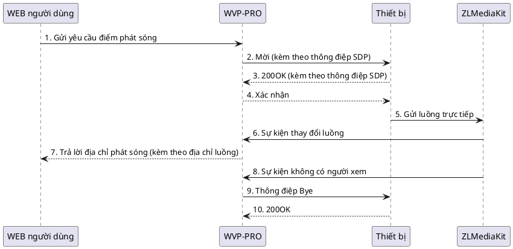

<!-- 点播流程 -->

# Điểm phát sóng

> Dưới đây là quy trình điểm phát sóng của WVP-PRO. Bất kỳ vấn đề nào xảy ra trong các bước trước khi điểm phát sóng thành công đều có thể dẫn đến quá thời gian điểm phát sóng, đây cũng là cơ sở để kiểm tra quá thời gian điểm phát sóng.

## Mô tả quy trình đăng ký như sau:

1. Người dùng từ trang web hoặc gọi giao diện gửi yêu cầu điểm phát sóng;
2. WVP-PRO gửi thông điệp Mời đến camera, trong tiêu đề thông điệp có trường Subject, chỉ ra ID nguồn video điểm phát sóng, số thứ tự luồng phương tiện của người gửi, IP sử dụng để nhận luồng của ZLMediaKit, số thứ tự luồng phương tiện của người nhận và các tham số khác, trong thông điệp SDP trường s là "Play" đại diện cho điểm phát sóng trực tiếp, trường y mô tả giá trị SSRC, trường f mô tả các tham số phương tiện.
3. Camera trả lời WVP-PRO bằng thông điệp 200OK, trong thông điệp mô tả IP, cổng, định dạng phương tiện, trường SSRC của người gửi luồng phương tiện.
4. WVP-PRO trả lời thiết bị bằng thông điệp Xác nhận, thiết lập phiên thành công.
5. Thiết bị gửi luồng trực tiếp đến ZLMediaKit.
6. ZLMediaKit gửi sự kiện thay đổi luồng đến WVP-PRO.
7. WVP-PRO trả lời địa chỉ phát sóng cho người dùng WEB.
8. ZLMediaKit gửi sự kiện không có người xem đến WVP.
9. WVP-PRO trả lời thiết bị bằng thông điệp Bye, kết thúc phiên.
10. Thiết bị trả lời 200OK, kết thúc phiên thành công.
