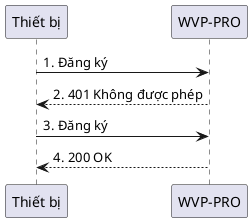

<!-- 注册流程 -->

# Quy trình đăng ký
WVP-PRO hiện chỉ hỗ trợ quy trình đăng ký cơ bản được mô tả trong tiêu chuẩn quốc gia, đây cũng là quy trình phổ biến nhất,
> Quy trình đăng ký cơ bản sử dụng công nghệ bảo mật thách thức-đáp ứng dựa trên chữ ký số được quy định trong IETF RFC 3261.

> Mô tả quy trình đăng ký như sau:
> 1. Camera gửi yêu cầu Đăng ký đến máy chủ WVP-PRO;
> 2. WVP-PRO gửi phản hồi 401 đến camera và cung cấp cơ chế xác thực và tham số phù hợp trong trường WWW_Authenticate của tiêu đề phản hồi;
> 3. Camera gửi lại yêu cầu Đăng ký đến WVP-PRO, cung cấp chứng thư trong trường Authorization, bao gồm thông tin xác thực;
> 4. WVP-PRO xác minh yêu cầu, nếu xác định danh tính camera hợp lệ, gửi phản hồi thành công 200 OK, nếu danh tính không hợp lệ thì gửi phản hồi từ chối dịch vụ.
